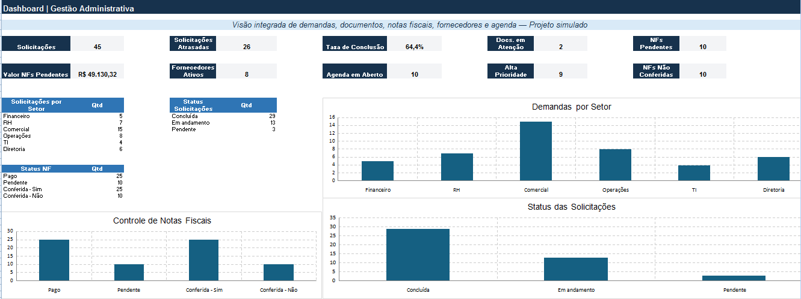

# 🗂️ Projeto de Gestão Administrativa — Central de Controles

> **Projeto simulado desenvolvido para fins de portfólio profissional.**  
> Os dados utilizados são fictícios e foram criados exclusivamente para estudo, prática e demonstração de competências.

## 🎯 Sobre o projeto

Projeto desenvolvido em Excel para simular uma rotina de **gestão administrativa**, reunindo diferentes controles utilizados no acompanhamento das atividades de uma empresa.

A proposta foi centralizar informações relacionadas a solicitações internas, documentos, notas fiscais, fornecedores, agenda e prazos, facilitando a organização, conferência e acompanhamento das demandas administrativas.

## 📊 Dashboard de Gestão Administrativa

O projeto conta com um dashboard para acompanhamento dos principais indicadores administrativos, permitindo uma visão consolidada das informações registradas nas diferentes áreas de controle.

### Principais indicadores

| Indicador | Resultado |
|---|---:|
| Solicitações | 45 |
| Solicitações atrasadas | 26 |
| Taxa de conclusão | 64,4% |
| Documentos em atenção | 2 |
| Notas fiscais pendentes | 10 |
| Valor de NFs pendentes | R$ 49.130,32 |
| Fornecedores ativos | 8 |
| Itens da agenda em aberto | 10 |
| Solicitações de alta prioridade | 9 |
| NFs não conferidas | 10 |

## 🗂️ Controles desenvolvidos

O projeto foi estruturado em diferentes módulos administrativos:

- **Solicitações:** registro e acompanhamento de demandas internas;
- **Documentos:** organização e controle de documentos e vencimentos;
- **Notas Fiscais:** registro, conferência e acompanhamento de pendências;
- **Fornecedores:** cadastro e acompanhamento de fornecedores;
- **Agenda:** organização de compromissos e atividades administrativas;
- **Dashboard:** consolidação dos principais indicadores;
- **Procedimentos:** organização das orientações utilizadas nos controles.

## 📋 Gestão de Solicitações

O controle de solicitações permite acompanhar informações como:

- Data de abertura
- Setor solicitante
- Responsável
- Prioridade
- Prazo
- Status
- Data de conclusão
- Identificação de atrasos

No cenário simulado, foram registradas **45 solicitações**, sendo:

- **29 concluídas**
- **13 em andamento**
- **3 pendentes**

As solicitações estão distribuídas entre os setores **Financeiro, RH, Comercial, Operações, TI e Diretoria**.

## 🧾 Controle de Notas Fiscais

O projeto também contempla o acompanhamento administrativo de notas fiscais, permitindo organizar registros, conferir informações e identificar documentos que ainda possuem pendências.

Foram utilizados **35 registros simulados de notas fiscais** para estruturar esse controle.

O dashboard permite acompanhar informações como:

- Notas fiscais pagas
- Notas fiscais pendentes
- Conferência dos documentos
- Valor total das pendências

## 📁 Controle de Documentos

A área de documentos foi estruturada para auxiliar na organização dos registros e no acompanhamento de vencimentos, permitindo identificar documentos que necessitam de atenção.

## 🤝 Controle de Fornecedores

O cadastro de fornecedores reúne informações para facilitar a organização e o acompanhamento administrativo dos fornecedores utilizados no cenário simulado.

## 📅 Agenda Administrativa

A agenda permite acompanhar atividades, compromissos e pendências, contribuindo para o controle de prazos e para a organização da rotina administrativa.

## 🛠️ Ferramentas e recursos utilizados

- Microsoft Excel
- Fórmulas e indicadores
- Tabelas estruturadas
- Validação de dados
- Formatação condicional
- Organização e tratamento de dados
- Controle de prazos
- Dashboard administrativo

## 💡 Competências demonstradas

- Excel intermediário
- Organização administrativa
- Controle de documentos
- Conferência de notas fiscais
- Cadastro e acompanhamento de fornecedores
- Gestão de solicitações
- Controle de prazos
- Organização de informações
- Construção de indicadores
- Elaboração de dashboard
- Atenção aos detalhes

## 📁 Arquivo do projeto

A planilha completa está disponível neste repositório:

**`Projeto Gestão Administrativa.xlsx`**

> Para visualizar as fórmulas, controles e funcionalidades do projeto, faça o download do arquivo e abra-o no Microsoft Excel.

---

## 👩‍💼 Sobre este portfólio

Este projeto integra meu portfólio profissional voltado para oportunidades como **Assistente Administrativo e Assistente Administrativo Financeiro**.

Todos os dados apresentados são simulados e foram criados exclusivamente para fins de estudo, prática e demonstração de competências profissionais.
